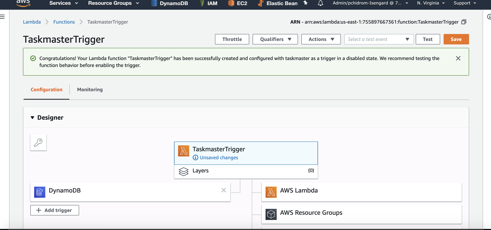

# Taskmaster

## Description
Taskmaster is a full stack web app that allows users to enter and track tasks accordingly.

**Running the app:**

Deployed:
* [Back End](http://taskmaster-env.p2inzhbxb8.us-east-1.elasticbeanstalk.com/tasks)
* [Front End](http://taskmasterfront.s3-website-us-west-2.amazonaws.com/)

Locally:
- git clone this repo
- In an IDE open the Taskmaster project and run the TaskmasterApplication class

***

**Routes:**

GET:
http://localhost:5000/tasks
- Returns all tasks in JSON format

GET:
http://localhost:5000/users/{name}/tasks
- Returns tasks assigned to a user or empty array if user not found

GET:
http://localhost:5000/tasks/{id}
- Returns the task object with the image included

POST:
http://localhost:5000/tasks?title=mytitle&assignee=name&description=thedesc
- Adds a task and returns the task as JSON

POST:
http://localhost:5000/tasks/{id}/images
-Assigns an image to a specific task

PUT:
http://localhost:5000/tasks/{id}/state
- Advances a task from: Available -> Assigned -> Accepted -> Finished

PUT:
http://localhost:5000/tasks/{id}/assign/{assignee}
- Assigns a task to assignee and sets status to assigned

***

### Taskmaster DynamoDB Trigger with Lambda

### Tasktopic SNS

***

**Code**

[Task Model class](src/main/java/com/chidrome/taskmaster/taskmaster/models/TaskInfo.java)

[Task Controller class](src/main/java/com/chidrome/taskmaster/taskmaster/controllers/TaskmasterController.java)
***

**Testing**

[Integration test class](src/test/java/com/chidrome/taskmaster/taskmaster/TaskmasterIntegrationTests.java)
***